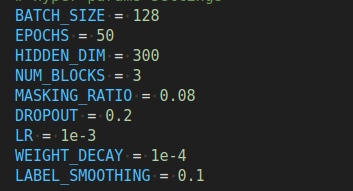
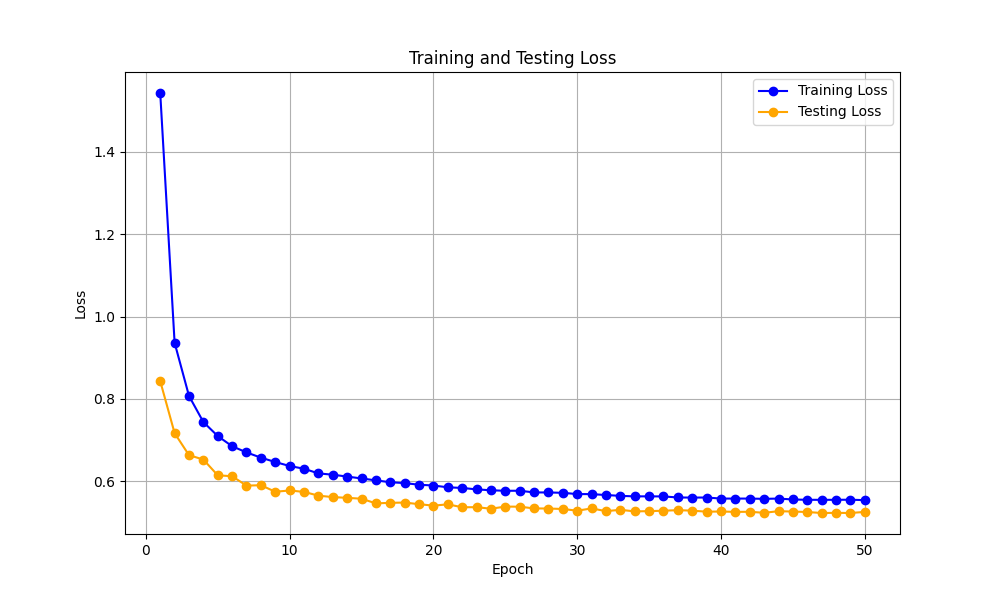
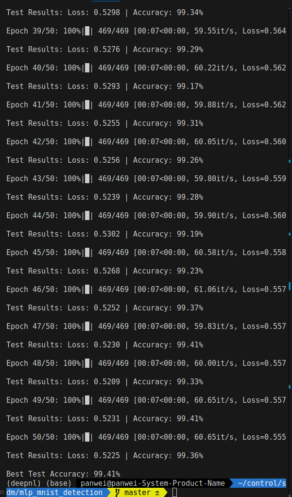
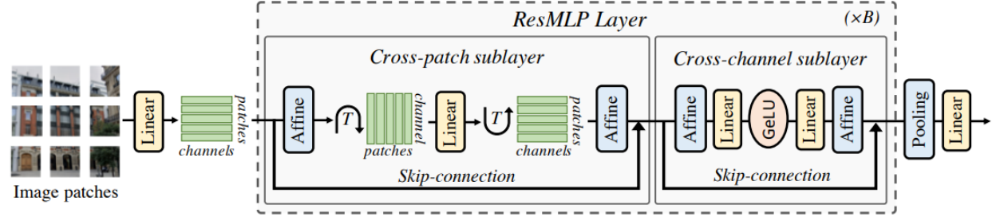
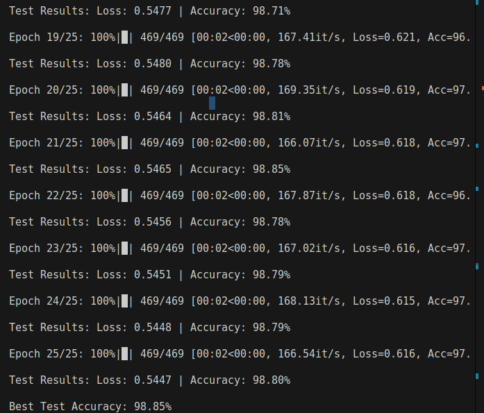
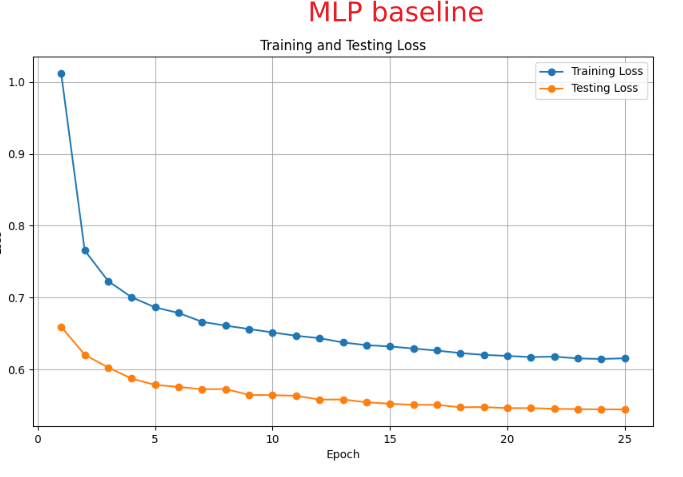

### ResMLP with Patching masking Report[Wei Pan(潘炜)]
> to reproduce the result, please refer to [here](./Experiment.md)

I will implement **ResMLP with patch masking**. ResMLP was  proposed on Meta's paper [ResMLP] (https://arxiv.org/abs/2105.03404), which means MLP with residual connection. I added patches masking to increase the model's robustness. By the way, resnet is simple and beautiful. Also thanks to Kaiming He's Resnet [Paper](https://arxiv.org/abs/1512.03385).  And I implement a simple MLP baseline. Below are results and implementation details. 
### Result
| Model                     | accuracy (%) |
|--------------------------|----------|
| MLP  baseline                   | 98.85    |
| **ResMLP**                  | 99.30    |
| **ResMLP with Patch Masking** | 99.41    |
### MLP with Resiual
hyperparameter settings

get bese accuracy of `99.41%`


#### key network design of ResMLP with patch masking

- using Affine transforme to replace layer normalization
implementation
- use token-mixing and channel mixing to capture the global information.
- add random patch masking to increase robustness of the model.

code implementation of ResMLP with patch masking

```
# note nn.Conv2d is used to generate image patch, not to implement a traditional convolutional nerual network

class Patch_rizer(nn.Module):
    def __init__(self, in_channels, images_size, patches_size, dim, masking_ratio=0.08):
        super().__init__() 
        if images_size % patches_size != 0:
            raise ValueError("error: images_size must be divisible by patches_size!")
        self.patch = nn.Conv2d(in_channels, dim, patches_size, patches_size)
        self.reshape = Rearrange('b c h w -> b (h w) c')
        self.masking_ratio = masking_ratio

    def forward(self, x: torch.Tensor) -> torch.Tensor:
        x = self.patch(x)       # [B, dim, H/p, W/p]
        x = self.reshape(x)    # flatten the patches [B, num_patches, dim]
        if self.training:
            # print("masking")
            B, N, D = x.shape
            mask = torch.rand(B, N, 1, device=x.device) > self.masking_ratio
            x = x * mask.float()
        # else:
        #     print("testing, no mask")
        return x

class Affine(nn.Module):
    def __init__(self, dim):
        super().__init__()
        self.alpha = nn.Parameter(torch.ones([1, 1, dim]))
        self.beta = nn.Parameter(torch.ones([1, 1, dim]))
    
    def forward(self, x):
        return x * self.alpha + self.beta 

class Mlp_block(nn.Module):
    def __init__(self, dim, dropout=0.2):
        super().__init__()
        hidden_dim = 4 * dim
        self.net = nn.Sequential(
            Affine(dim),
            nn.Linear(dim, hidden_dim),
            nn.GELU(),
            nn.Dropout(dropout),
            nn.Linear(hidden_dim, dim),
            nn.Dropout(dropout),
            Affine(dim)
        )
    def forward(self, x):
        x = self.net(x)
        return x

class ResMLP_block(nn.Module):
    def __init__(self, dim, images_size, patches_size, dropout, layerscale_init=1.0, masking=False):
        super().__init__()
        num_patches = (images_size // patches_size) * (images_size // patches_size)
        self.cross_patch_sublayer = nn.Sequential(
            Affine(dim),
            Rearrange('b n d -> b d n'),
            nn.Linear(num_patches, num_patches),
            Rearrange('b d n -> b n d'),
            Affine(dim)
        )

        self.layerscale_1 = nn.Parameter(layerscale_init * torch.ones((dim))) # LayerScale
        self.layerscale_2 = nn.Parameter(layerscale_init * torch.ones((dim))) # parameters
        self.cross_channel_sublayer = Mlp_block(dim, dropout=dropout)

    def forward(self, x):
        # res_1 = self.cross_patch_sublayer(x)
        res_1 = self.cross_patch_sublayer(x)
        x = x + self.layerscale_1 * res_1
        # res_2 = self.cross_channel_sublayer(x)
        res_2 = self.cross_channel_sublayer(x)
        x = x + self.layerscale_2 * res_2
        return x

class ResMLP(nn.Module):
    '''
    the version of model checkpoint
    '''
    def __init__(self, depth=3, in_channels=3, dim=200, images_size=28, patches_size=4, dropout=0.2, num_classes=10, masking_ratio=0.08):
        super().__init__()
        assert images_size % patches_size == 0
        self.patch_rizer = Patch_rizer(in_channels, images_size, patches_size, dim, masking_ratio)
        self.blocks = nn.ModuleList(
            [
                ResMLP_block(dim, images_size, patches_size, dropout, masking_ratio) for i in range(depth)               
            ] 
        )
        self.linear_head = nn.Linear(dim, num_classes)
    
    def forward(self, x: torch.tensor):
        B, C, H, W = x.shape
        x = self.patch_rizer(x)
        for blk in self.blocks:
            x = blk(x)
        x = x.mean(dim = 1).reshape(B, -1)
        output = self.linear_head(x)
        return output


```

### Baseline 
here I implement a very simple MLP baseline。
And using the same training hyper-params. And get `98.85%` best accuracy
```
class SimpleMLP(nn.Module):
    def __init__(self):
        super().__init__()
        self.model = nn.Sequential(
            nn.Linear(784, 256),  # 输入层到隐藏层
            nn.ReLU(),           # 激活函数
            nn.Dropout(DROPOUT), # Dropout 防止过拟合
            nn.Linear(256, 128), # 隐藏层到隐藏层
            nn.ReLU(),           # 激活函数
            nn.Dropout(DROPOUT), # Dropout 防止过拟合
            nn.Linear(128, 10)   # 隐藏层到输出层
        )

    def forward(self, x):
        x = x.view(-1, 784)  # 将输入展平为 1D 向量
        x = self.model(x)
        return x
```





### Abliation Study
to do